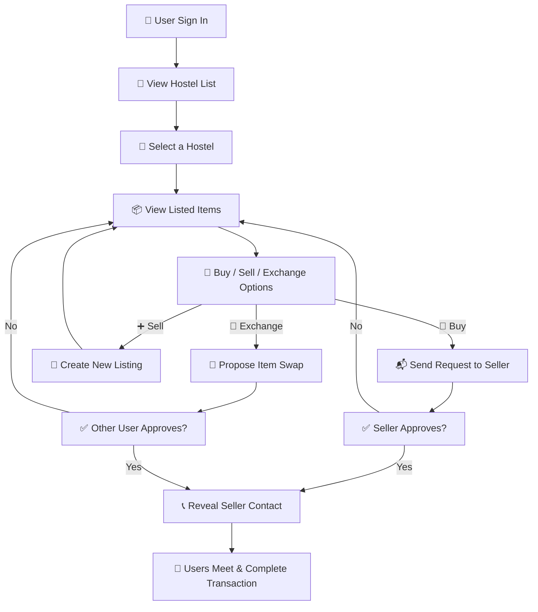

# 🚲 Unicycle

**Unicycle** is a modern, student-first **Progressive Web App (PWA)** marketplace built exclusively for college communities.  
Think **OLX meets Hostel Life** — fast, simple, and made for the *campus hustle*.

🎓 Students can **buy, sell, or exchange** essentials like lab coats, calculators, books, or even snacks.  
🌙 At night, it transforms into the **Night Market**, where hostel-only listings (chips, Maggi, etc.) come alive.  
💬 See who's **Active Now** with real-time presence updates powered by Supabase.

---

## 🚀 Features (Phase 1)

- 🔐 **Google OAuth** restricted to `@thapar.edu`  
- ⚡ **Supabase-powered backend** (Auth · DB · Storage · Realtime)  
- 🕶️ Always-on **dark theme** with clean, modern UI  
- 📦 **List, browse & search** items across categories  
- 🌆 **Auto Day/Night Market switch** based on device time  
- 💬 **Active Now indicator** via Supabase Realtime  
- ✅ **Seller approval flow** → buyer requests, seller approves/rejects  
- 📸 Manual image uploads for listings  
- 📱 **PWA support** (installable + offline access)

---

## 🧑‍💻 Tech Stack

| Layer | Technology |
|-------|-------------|
| Frontend | **Next.js 15 (App Router)** + Tailwind CSS + PWA |
| Backend | **Supabase** (Auth · DB · Storage · Realtime) |
| Database | **PostgreSQL (managed by Supabase)** |
| Auth | **Google OAuth (@thapar.edu restricted)** |
| Hosting | **Vercel (Frontend)** + **Supabase Cloud** |
| Design | Figma (Dark Minimal UI) |

---

## 🛠️ Project Structure

```bash
unicycle/
├── app/                     # Next.js App Router pages
│   ├── components/           # Reusable UI Components
│   ├── listings/             # Listing pages & logic
│   ├── profile/              # User profile page
│   ├── api/                  # Route handlers & server actions
│   ├── globals.css           # Global Tailwind styles
│   └── layout.tsx            # Root layout & metadata
│
├── lib/                      # Supabase client & helpers
├── public/                   # Manifest, icons & static assets
├── utils/                    # Utility functions & constants
├── .env.local                # Environment variables
└── README.md
```

---

## 🛣️ Roadmap

### ✅ Phase 1 (MVP)

* [x] Google OAuth (@thapar.edu only)
* [x] Supabase Auth + Database
* [x] Listings CRUD + Seller approval
* [x] Auto Day/Night Market toggle
* [x] PWA install support

### 🌓 Phase 2

* [ ] Ratings & Reviews
* [ ] Improved UI/UX & animations
* [ ] Push Notifications (Web Push)
* [ ] Admin moderation & reporting
* [ ] Realtime Active Presence

### 💰 Phase 3

* [ ] Monetization (Premium Listings · Featured Items)
* [ ] Analytics Dashboard
* [ ] Campus Store & Event Integrations

---

## 📊 User Flow


```mermaid
graph TD;
    A[🔐 User Sign In] --> B[🏫 View Hostel List] 
    B --> C[🏢 Select a Hostel]
    C --> D[📦 View Listed Items]
    D --> E[🤝 Buy / Sell / Exchange Options]
    
    E -->|🛒 Buy| F[📬 Send Request to Seller]
    F --> G[✅ Seller Approves?]
    G -- No --> D
    G -- Yes --> H[📞 Reveal Seller Contact]
    H --> I[👥 Users Meet & Complete Transaction]

    E -->|➕ Sell| J[📝 Create New Listing]
    J --> D

    E -->|🔁 Exchange| M[🔄 Propose Item Swap]
    M --> N[✅ Other User Approves?]
    N -- No --> D
    N -- Yes --> H
```


---

## 🧠 Notes

* 💡 Only verified **@thapar.edu** emails can log in.
* 🆓 Transactions are **offline only** (no in-app payments).
* ⚡ Realtime presence handled via **Supabase Realtime**.
* 🧑‍💻 Built as a **PWA** for mobile-first access with offline caching.

---

## 🧩 Developer Setup

```bash
# Clone the repository
git clone https://github.com/aayush-bindal/Unicycle.git
cd Unicycle

# Install dependencies
npm install

# Copy and configure environment variables
cp .env.example .env.local

# Start the development server
npm run dev
```

Then open **[http://localhost:3000](http://localhost:3000)** 🚀

---

## 🤝 Contributing

Contributions are welcome!
Submit issues, ideas, or pull requests — every improvement helps students trade smarter 🎓

```bash
git clone https://github.com/aayush-bindal/Unicycle.git
```

---

## 📜 License

MIT License © 2025 **Unicycle**
Built with ❤️ by students, for students.
